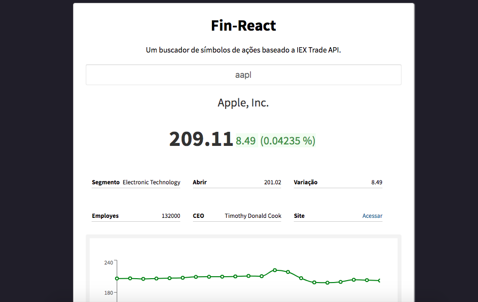

# Fin-React

Aplicação desenvolvida com React e Redux + Redux-Saga, baseada na API da [IEX Trade API](https://iexcloud.io/docs/api/ "IEX Trade"), que busca através de símbolos das empresas, informações de ações e seus detalhes na bolsa de valores.

#### Instalação

  - `yarn install` ou `npm install` na raiz do projeto
  - Executar `yarn start` ou `npm start`
